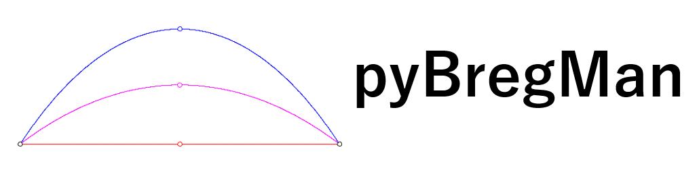

**pyBregMan**:

A Python library for geometric computing on BREGman MANifolds with applications.
The focus of the library is to provide a specialized framework for Bregman manifolds: dually flat manifolds which consists of two convex generators related via Legendre–Fenchel duality.

# Installation

pyBregMan can be installed via `pip3` or `git`.

For the former (using `pip3`), one can call:

```
pip3 install pyBregMan
```

For `git` installation, one can directly clone from GitHub.

```
git clone https://github.com/alexandersoen/pyBregMan.git
cd pyBregMan
pip3 install .
```

# Getting Started

To use `pyBregMan`, a user can define `Point`s on a specified Bregman manifold, where additional geometric objects (Geodesics, notions of dissimilarities, etc) can be defined on.
Such a procedure consists of:
  - defining a `BregmanManifold` object;
  - specifying data via `Point` objects;
  - defining additional objects which act on a manifold object and data.

In addition, we also provide an inbuilt visualization framework which calls `matplotlib`.

In the following code example, we define the manifold of bivariate Gaussian distribution. We then define and compute different types of centroids. Finally, we visualize the data and centroids.

```python
import numpy as np

from bregman.application.distribution.exponential_family.gaussian import GaussianManifold
from bregman.base import LAMBDA_COORDS, DualCoords, Point

# Define Bivariate Normal Manifold
manifold = GaussianManifold(input_dimension=2)

# Define data
to_vector = lambda mu, sigma: np.concatenate([mu, sigma.flatten()])
mu_1, sigma_1 = np.array([0.0, 1.0]), np.array([[1.0, 0.5], [0.5, 2.0]])
mu_2, sigma_2 = np.array([1.0, 2.0]), np.array([[2.0, 1.0], [1.0, 1.0]])

point_1 = Point(LAMBDA_COORDS, to_vector(mu_1, sigma_1))
point_2 = Point(LAMBDA_COORDS, to_vector(mu_2, sigma_2))

# KL divergence can be calculated
kl = manifold.kl_divergence(point_1, point_2)
rkl = manifold.kl_divergence(point_2, point_1)

print("KL(point_1 || point_2):", kl)
print("KL(point_2 || point_1):", rkl)

from bregman.barycenter.bregman import BregmanBarycenter, SkewBurbeaRaoBarycenter 

# We can define and calculate centroids
theta_barycenter = BregmanBarycenter(manifold, DualCoords.THETA)
eta_barycenter = BregmanBarycenter(manifold, DualCoords.ETA)
br_barycenter = SkewBurbeaRaoBarycenter(manifold)
dbr_barycenter = SkewBurbeaRaoBarycenter(manifold, DualCoords.ETA)

theta_centroid = theta_barycenter([point_1, point_2])
eta_centroid = eta_barycenter([point_1, point_2])
br_centroid = br_barycenter([point_1, point_2])
dbr_centroid = dbr_barycenter([point_1, point_2])

print("Right-Sided Centroid:", manifold.convert_to_display(theta_centroid))
print("Left-Sided Centroid:", manifold.convert_to_display(eta_centroid))
print("Bhattacharyya Centroid:", manifold.convert_to_display(br_centroid))

from bregman.visualizer.matplotlib.callback import VisualizeGaussian2DCovariancePoints
from bregman.visualizer.matplotlib.matplotlib import MatplotlibVisualizer

# These objects can be visualized through matplotlib
visualizer = MatplotlibVisualizer(manifold, (0, 1))
visualizer.plot_object(point_1, c="black")
visualizer.plot_object(point_2, c="black")
visualizer.plot_object(theta_centroid, c="red", label="Right-Sided Centroid")
visualizer.plot_object(eta_centroid, c="blue", label="Left-Sided Centroid")
visualizer.plot_object(br_centroid, c="purple", label="Bhattacharyya Centroid")
visualizer.add_callback(VisualizeGaussian2DCovariancePoints())

visualizer.visualize(LAMBDA_COORDS)  # Display coordinate type
```

